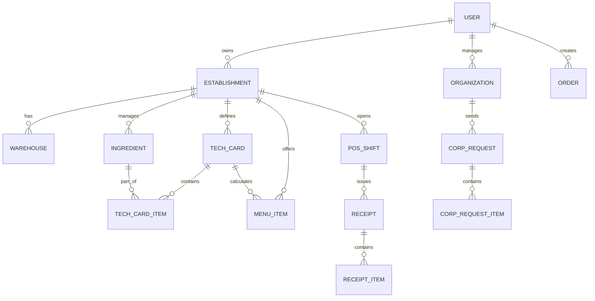

# План № 002: Комплексный план разработки платформы общепита (B2B/B2C)

**Дата и время:** 2026-08-18 10:15

---

## 1. Архитектурный базис (GitHub Pages Client-Side Only)

Платформа строится как высокопроизводительный модульный Single Page Application (SPA) на чистом JavaScript (ES Modules) и токенизированном CSS3 без сборщиков и без бэкенд-серверов.

```
Food/
├── .artifacts/                      # История разработки
├── index.html                       # Точка входа SPA + FOUC-скрипт
├── css/
│   ├── tokens.css                   # 5 тем, статусные цвета, data-viz токены
│   ├── base.css                     # Reset, шрифты Manrope, общая сетка
│   ├── layout.css                   # Шапка, сайдбар, подвал, модалки, тосты
│   └── components/                  # Стили модулей (cards, tables, pos, map)
├── js/
│   ├── app.js                       # Точка входа приложения
│   ├── router.js                    # Hash-роутер (#/showcase, #/pos, #/business, ...)
│   ├── state/
│   │   ├── db.js                    # Хранилище (LocalStorage/IndexedDB wrapper)
│   │   ├── store.js                 # Реактивный стейт-менеджер (Pub/Sub)
│   │   ├── auth.js                  # Менеджер сессий и переключения ролей
│   │   └── seed.js                  # Богатые демо-данные (меню, техкарты, склады)
│   ├── theme/
│   │   └── themeManager.js          # Переключение 5 тем, синхронизация, a11y
│   ├── services/
│   │   ├── calculationService.js    # Калькулятор себестоимости и КБЖУ
│   │   ├── stockService.js          # Автоматическое списание по техкартам
│   │   └── exportService.js         # Экспорт/импорт базы данных в JSON
│   ├── components/                  # Переиспользуемые UI-компоненты
│   └── views/                       # Экраны и страницы приложения
│       ├── showcaseView.js          # Витрина с фильтрами и картой
│       ├── dishDetailModal.js       # Карточка блюда с КБЖУ
│       ├── posView.js               # POS-терминал кассира (Neo-Dark)
│       ├── businessWarehouseView.js # Складской учёт и остатки
│       ├── businessRecipesView.js   # Конструктор техкарт и полуфабрикатов
│       ├── businessMenuView.js      # Конструктор меню и расписания
│       ├── businessFinanceView.js   # Финансы, P&L и себестоимость
│       ├── corporateRequestsView.js # Корпоративные B2B-заявки
│       ├── adminView.js             # Админ-панель и модерация
│       └── profileAnalyticsView.js  # Личная аналитика КБЖУ и профиль
└── assets/
    ├── icons/                       # SVG-иконки (currentColor)
    └── data/seedData.json           # Структурированный JSON базы данных
```

---

## 2. Модель данных (Клиентская СУБД)

Все сущности связываются реляционными ID и сохраняются в `localStorage` с автоматическим версионированием:



1. **`users`**: id, name, email, phone, activeRole, roles (`client`, `business`, `corporate`, `admin`), appearance (`theme`, `themeBySection`).
2. **`establishments`**: id, ownerId, name, category, logo, address, lat, lng, rating, status (`open`, `closed`).
3. **`ingredients`**: id, estId, name, unit (`кг`, `л`, `шт`), purchasePrice, calories, protein, fat, carbs, allergens, stockQty.
4. **`techCards`**: id, estId, name, isSemiFinished, yieldNetto, items `[{ingredientId, grossQty, lossPercent, netQty}]`, calculatedCost, calculatedKbju, version.
5. **`menuItems`**: id, estId, techCardId, name, category, retailPrice, corpPrice, photo, inStopList, isDaily, daySchedule.
6. **`orders`**: id, userId, estId, type (`retail`, `corporate`), items `[{menuItemId, qty, price, kbjuSnapshot}]`, totalSum, status, createdAt.
7. **`posShifts`**: id, estId, cashierName, openedAt, closedAt, totalSales, cashSum, cardSum, status (`open`, `closed`).
8. **`corpRequests`**: id, orgId, estId, date, items `[{menuItemId, portionsCount, targetDept}]`, status, totalSum.

---

## 3. Этапы реализации (Фазы и Спринты)

### 🔹 ЭТАП 1: Фундамент, Дизайн-система и 5 Тем (Спринт 1)
* [ ] Реализация `css/tokens.css` со всеми токенами для тем `fresh`, `appetite`, `neo-dark`, `corporate`, `premium`.
* [ ] Подключение шрифта *Manrope* (Google Fonts) с точной типографической сеткой.
* [ ] Создание механизма `ThemeManager`:
  * Защита от FOUC (inline-скрипт чтения темы).
  * Плавные CSS-переходы (250 мс) с уважением `prefers-reduced-motion`.
  * Быстрая панель переключения тем в шапке (с предпросмотром палитр) и в настройках профиля.
  * Назначение дефолтных тем по контексту ролей (Клиент $\rightarrow$ `fresh`, Бизнес $\rightarrow$ `corporate`, POS $\rightarrow$ `neo-dark`).
* [ ] Верстка базового каркаса (Shell): адаптивная шапка, панель смены ролей, меню навигации, контейнер представлений, тосты и шторка корзины.

### 🔹 ЭТАП 2: Архитектура состояния, Мок-СУБД и Мультиролевость (Спринт 2)
* [ ] Реализация движка `DB` на базе `localStorage` с транзакционным сохранением и откатом.
* [ ] Генерация демонстрационного набора данных `seedData.json`:
  * 3 заведения общепита (Столовая, Бургерная, Премиум-ресторан).
  * 2 корпоративных заказчика с отделами и лимитами.
  * Справочники сырья (25+ ингредиентов с КБЖУ и закупочными ценами в сомах).
  * 15+ техкарт (включая полуфабрикаты: тесто, соусы, мясные заготовки).
  * 20+ блюд с ценами, фото и аллергенами.
* [ ] Менеджер мультиролевой аутентификации: переключение ролей «Клиент $\leftrightarrow$ Владелец общепита $\leftrightarrow$ Кассир $\leftrightarrow$ Организация-заказчик $\leftrightarrow$ Администратор» в 1 клик.
* [ ] Модуль импорта/экспорта всей базы в JSON файл.

### 🔹 ЭТАП 3: Витрина блюд, Поиск, Фильтрация и Карта (Спринт 3 — B2C MVP)
* [ ] Экран каталога блюд:
  * Полнотекстовый живой поиск по названию и ингредиентам.
  * Фильтрация: категории, ценовой диапазон (в сомах), калорийность (КБЖУ), аллергены, диетические метки (Веган, Халяль, Без глютена).
  * Карточки блюд с динамическими значками и ценами.
* [ ] Модальное окно детализации блюда:
  * Фотография, подробный состав, аллергены, вес порции.
  * Визуализация КБЖУ с прогресс-барами питательной ценности.
  * Добавление в корзину с выбором количества.
* [ ] Интерактивная карта общепитов и организаций:
  * Векторная интерактивная карта с геометками и кластеризацией.
  * Карточка общепита по клику на метку с переходом к дневному меню.
* [ ] Корзина и симуляция оформления заказа:
  * Выбор типа заказа (Самовывоз / Доставка).
  * Оплата (Наличные, Карта).
  * Трекер жизненного цикла заказа с таймером и статусами.

### 🔹 ЭТАП 4: Модуль «Бизнес» — Склад, Техкарты и Калькуляция (Спринт 4 — B2B Общепит)
* [ ] **Складской и товарный учёт:**
  * Таблица остатков сырья с подсветкой критического минимума.
  * Оформление приходных накладных с пересчётом средней закупочной цены.
  * Акты списания и инвентаризации с фиксацией суммовых потерь.
* [ ] **Конструктор технологических карт и полуфабрикатов:**
  * Интерактивный калькулятор: добавление ингредиентов/полуфабрикатов, учёт холодной/горячей обработки.
  * Автоматический расчёт себестоимости и маржинальности в сомах в реальном времени.
  * Автоматический расчёт КБЖУ на 100г и на порцию на основе базы ингредиентов.
  * Версионирование рецептур.
* [ ] **Управление меню:**
  * Назначение розничных и корпоративных цен.
  * Управление стоп-листом.
  * Составление дневного меню на неделю.

### 🔹 ЭТАП 5: Модуль POS-терминала кассира (Спринт 5 — Точка продаж)
* [ ] Сенсорный интерфейс кассира (с авто-активацией темы `neo-dark`):
  * Быстрая сетка блюд с фильтрацией по категориям.
  * Формирование чека с изменением количества и скидками.
  * Разделение оплаты (наличные, карта, корпоративный счёт).
* [ ] Управление кассовой сменой:
  * Открытие/закрытие смены.
  * Формирование X-отчёта и Z-отчёта со сводкой выручки.
* [ ] Автоматическое списание сырья со склада по техкартам в момент фискализации чека.

### 🔹 ЭТАП 6: Корпоративные заявки B2B и Финансы P&L (Спринт 6)
* [ ] **Кабинет организации-заказчика:**
  * Формирование корпоративной заявки на сотрудников по дням.
  * Шаблоны регулярного питания.
  * Учёт лимитов и баланса организации.
* [ ] **Приём и обработка заявок общепитом:**
  * Канбан-доска / список входящих заявок.
  * Оценка загрузки кухни и подтверждение.
* [ ] **Финансовый учёт P&L:**
  * Отчёт о прибылях и убытках: Выручка $\rightarrow$ Себестоимость (COGS) $\rightarrow$ Валовая прибыль $\rightarrow$ Расходы $\rightarrow$ Чистая прибыль.
  * Анализ маржинальности блюд и категорий с графиками на data-viz палитре.

### 🔹 ЭТАП 7: Панель Администратора, Аналитика КБЖУ и Тестирование (Спринт 7)
* [ ] **Админ-панель платформы:**
  * Управление пользователями, верификация общепитов и организаций.
  * Модерация меню и карточек блюд.
  * Глобальные классификаторы (категории, аллергены, диеты).
  * Сводная статистика платформы (GMV, комиссии).
* [ ] **Личная аналитика КБЖУ (для клиента):**
  * Графики калорийности и баланса БЖУ по дням и неделям на основе совершенных заказов.
* [ ] **Комплексная проверка доступности (A11y WCAG 2.1 AA) и мобильная адаптивность.**
* [ ] **Подготовка к публикации на GitHub Pages.**

---

## 4. Критерии приёмки и валидации

1. **GitHub Pages Ready:** Все файлы открываются локально и по HTTPS на `gh-pages` без 404 ошибок и без необходимости сборки Node.js.
2. **5 тем:** Каждая тема мгновенно активируется, сохраняется в профиле, проходит тест на контрастность текста (не ниже 4.5:1).
3. **Целостность учета:** Продажа на POS-терминале или через Витрину мгновенно уменьшает складские остатки сырья в соответствии с техкартой.
4. **Персистентность:** Все созданные блюда, заказы, техкарты и настройки сохраняются между перезагрузками страницы и легко экспортируются в JSON.
